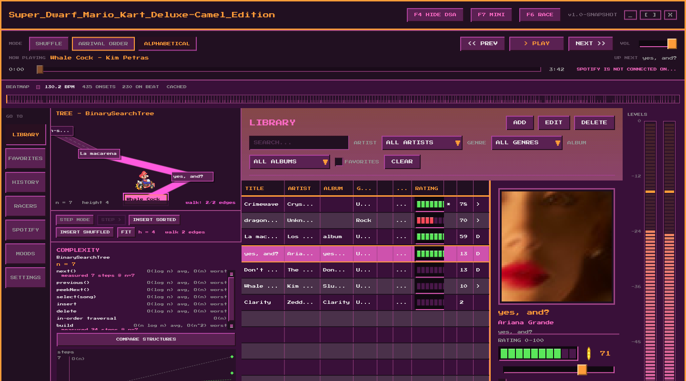
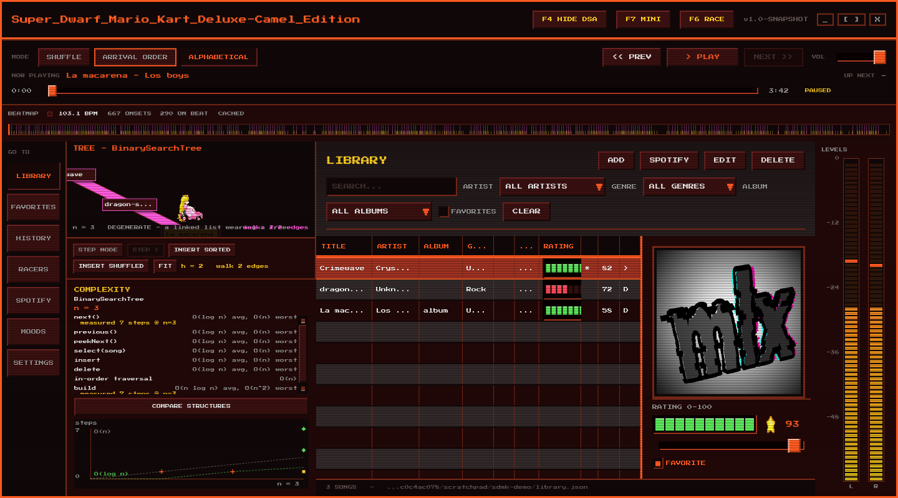
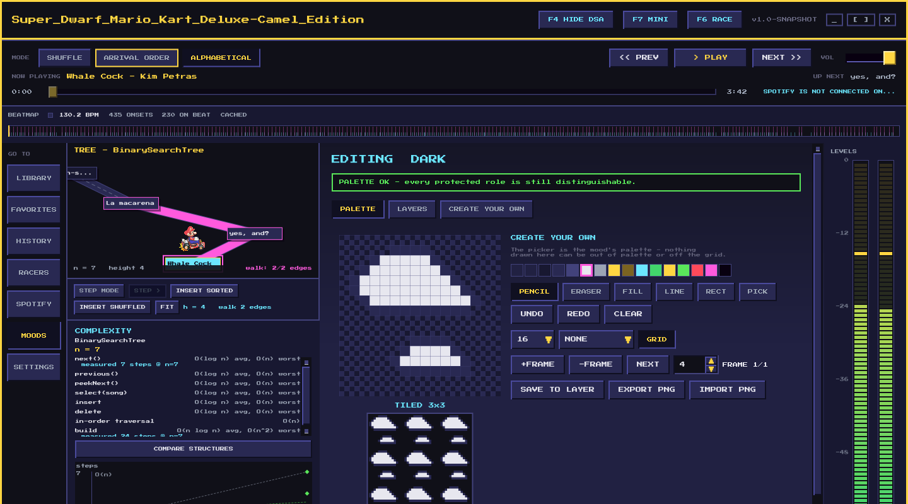

# Super_Dwarf_Mario_Kart_Deluxe-Camel_Edition

A JavaFX desktop music player built around three **hand-written data structures**, with a
beat-synchronised Mario-Kart-styled rhythm game riding on top of the audio it plays.

A Data Structures course project, by [@mariajsosafdez](https://github.com/mariajsosafdez),
[@SamuelBhoop](https://github.com/SamuelBhoop), Claude and
[@alejandruxxug](https://github.com/alejandruxxug).

> The name is intentional, underscores and hyphen included. It is styled after a ROM filename
> and pairs with the 8-bit font. Short form: `SDMK_Deluxe`.

---

## Prerequisites

| Requirement | Notes |
|---|---|
| **JDK 25** | Built and tested on OpenJDK 25.0.2. |
| **Maven** | **Not required.** Use the bundled wrapper (`./mvnw`), which fetches Maven 3.8.5 on first use. |
| Internet, once | Only to download dependencies the first time. The application itself runs fully offline — the font is bundled, nothing is fetched at runtime. |

Everything else, including JavaFX 26, is resolved by Maven.

## Running

```bash
./mvnw javafx:run          # launch
./mvnw test                # run the JUnit suite
./mvnw clean compile       # compile only
```

Verify a launch without leaving a window on screen — it starts, prints what it checked, and
closes itself:

```bash
./mvnw javafx:run -Dsdmk.smokeTest=true
```

```
[smoke] window shown      : true
[smoke] window title      : Super_Dwarf_Mario_Kart_Deluxe-Camel_Edition
[smoke] 8-bit font loaded : true
[smoke] library view      : true
[smoke] songs loaded      : 5
[smoke] RESULT            : PASS
```

Two further switches help when demonstrating or debugging:

| Switch | Effect |
|---|---|
| `-Dsdmk.home=/tmp/sdmk-demo` | Use a scratch profile instead of `~/.superdwarfkart`, so a demo library can be seeded without touching your real one |
| `-Dsdmk.screenshot=shot.png` | During a smoke test, save a snapshot of the window — and one per view beside it, including every mood |

## Project status

Built milestone by milestone; each is verified before the next begins.

| # | Milestone | Status |
|---|---|---|
| M0 | Maven skeleton, `javafx:run` opens a styled window, font loads | ✅ |
| M1 | Domain model + the three hand-written structures + JUnit tests | ✅ |
| M2 | Library CRUD, search, 0–100 rating, cover display, JSON persistence | ✅ |
| — | Asset registry: keyword classification, frame inference, `assets.json`, drop-in folder | ✅ |
| M3 | Three playback modes behind one interface, mode selector, complexity panel | ✅ |
| M4 | **Structure visualizer** — circuit, starting grid, animated BST traversal, live complexity scatter, Presentation Mode | ✅ |
| M5 | Real playback, PCM tap, independent left/right level meters | ✅ |
| M6 | Offline beat analysis and beatmap cache | ✅ |
| M7 | The 3-lane rhythm runner | ✅ |
| M8 | Mini companion window | ✅ |
| M9 | Side rail, favourites, history, statistics, `DARK` + `LIGHT` moods, collapsible structure column | ✅ |
| M11 | **Mood system** — ten 16-colour GBA palettes, overlay layers, live customizer, pixel editor, `.gpl`/`.hex` import, validator. Dark mode ships here, as two moods among ten rather than a boolean | ✅ |
| M10 | *Optional:* Spotify playback and search through go-librespot | ✅ built; search runs on your own Spotify application and needs only a released daemon |

---

## The three hand-written structures

None of these is backed by a `java.util` collection. All are generic, and every public method
documents its time complexity in its Javadoc.

### `CircularDoublyLinkedList<T>` — shuffle playback
Doubly linked and circular, with no null terminators: past the tail is the head, before the head
is the tail, so traversal never ends. `next()` and `previous()` are O(1) — being doubly linked is
what makes stepping backwards constant rather than a full lap.

The shuffle is baked into the ring **once at load time** rather than rolled per step, so
`previous()` returns the song actually played before, and the next song is always predictable.

Its iterator walks **exactly one lap** and then stops, so a `for-each` over an endless ring
terminates.

### `SimpleQueue<T>` — arrival order playback
Strict FIFO with head and tail pointers, O(1) at both ends.

The queue is a **view built from the library, never the storage of it**. Draining it consumes
the view; the library keeps every song and the mode can be rebuilt at any time. A queue cannot
be walked backwards, so this mode reports that it has no `previous()` and the user interface
disables that button instead of letting it throw.

### `BinarySearchTree<T>` — alphabetical playback
Ordered by title, then artist, then identifier, case-insensitively. The tiebreakers matter: with
title alone, two different songs sharing a title compare equal and one is silently dropped.

Every node carries a **parent pointer**, and playback navigation is **real tree navigation** —
the in-order successor descends into the right subtree and runs left to its minimum, or climbs
through parents until it arrives from a left child; the predecessor mirrors it. The tree is never
flattened into an array and indexed.

Deletion handles all three cases (leaf, one child, two children via the in-order successor) by
**relinking nodes rather than copying values between them**.

---

## Where to put assets

There are two places artwork can live, and the registry scans both recursively — the folder
layout inside them does not matter:

| Where | For what |
|---|---|
| `src/main/resources/assets/` | art that ships with the application; needs a rebuild |
| `~/.superdwarfkart/assets/` | **drop-in folder — no rebuild.** Wins over a bundled file of the same name |

So new art can be tried out by copying it into `~/.superdwarfkart/assets/` and restarting.

Files are classified by case-insensitive keyword in the filename. **The table is in priority
order**: a name matching more than one row takes the first, because a filename says what a sprite
*is* and then qualifies it — `kart_explosion.png` is an explosion, `racer-select.png` is a menu.

| Asset | Matched keywords |
|---|---|
| Spinning disk | `disk`, `disc` |
| Select screen | `select` |
| Star | `star`, `estrella` |
| Coin | `coin`, `moneda` |
| Explosion | `explos` |
| Obstacle | `bump`, `obstacle` |
| Background | `bg`, `background`, `fondo` |
| Racer | `char`, `player`, `kart`, `racer`, `personaje`, **and every racer's name** |

A racer is also matched by name, because `Mario.png` contains none of those keywords. Two-letter
keywords match only as whole words, so `bgm-theme.png` is not mistaken for a background.

Spritesheets are sliced by inference: where the frame count is known the frame width is the image
width divided by that count; otherwise **frames are assumed square**, which correctly reads the
disk as 13 frames, the star as 9, the coin as 1 and each racer as 4 — no frame table needed.
Scanning reads filenames only; an image is decoded the first time it is actually drawn, so a
folder of large sheets costs nothing at startup.

**Nothing here is mandatory.** Any missing asset resolves to a labelled magenta placeholder and
logs one warning — the application always starts, with or without art. Run with
`-Dsdmk.smokeTest=true` to print what was found, what is missing, and how each sheet was sliced.

### Overriding the detection

An optional `assets.json` overrides every guess:

```json
{ "key": "untitled-4", "kind": "STAR", "file": "untitled-4.png", "frames": 9 }
```

`kind` is one of the rows above (or `UNKNOWN`); `frames` of `0` means "work it out from the
image". If no manifest exists, one is written to **`~/.superdwarfkart/assets/assets.json`** on
first run, already filled in with whatever was detected — so a wrong guess is corrected by
editing a line rather than by writing the file from scratch. It goes in the user folder because
that is the only writable location that survives `./mvnw clean`. An existing manifest is never
overwritten.

*(A few Spanish keywords appear in the table above. They are there because some sprites were
exported with Spanish filenames before the English-only rule existed. This is the only place in
the project where Spanish appears, and only ever as a pattern to match filenames against —
never as an identifier or as anything the user sees.)*

---

## The three playback modes

The mode selector at the top of the window does not change a setting — it swaps the data
structure the library is played from. `Player` holds a `PlaybackMode` and never asks which one
it is holding: no `instanceof`, no switch. Everything that follows from the choice is read back
off the interface.

| Mode | Structure | Order | Going back |
|---|---|---|---|
| Shuffle | `CircularDoublyLinkedList` | shuffled once at load, then fixed | O(1), and the ring wraps |
| Arrival order | `SimpleQueue` | as added to the library | **not possible** |
| Alphabetical | `BinarySearchTree` | by title, then artist | O(log n) predecessor |

The **complexity panel** on the left lists what the active mode's operations cost and the
current `n`, straight from `PlaybackMode.complexities()`. Switching mode changes the list — the
same search is O(n) over the ring and O(log n) in the tree, and the panel says so.

In arrival order the **previous button is disabled**, with a tooltip explaining why, rather than
being left to fail. A queue has no backwards; the interface says that instead of hiding it.

Two things this design protects:

- **Playing never empties your library.** A mode is a view built *from* the library, not the
  storage of it. Drain the queue to the end and the library still has every song — switching
  mode rebuilds from it.
- **Editing a song does not reorder playback.** Moving the rating slider would otherwise re-draw
  the shuffle on every pixel of travel, changing the running order while you listen.

Select a song in the table and press **Enter** to jump to it. Double-click still opens the
editor.

---

## How the beatmap cache works

Beat detection runs **off the playback path**, on a background thread, on import or first play —
never on the audio thread.

1. The file is decoded to PCM as fast as it reads.
2. A spectral-flux novelty curve is computed over 1024-sample windows with a 512-sample hop.
3. Peaks above an adaptive local threshold, at least ~100 ms apart, become onsets.
4. The tempo is estimated from a histogram of intervals between onsets; the onsets closest to
   that grid are marked as strong beats.

The result — tempo, duration, onsets, strong beats, intensity — is written to:

```
~/.superdwarfkart/beatmaps/<sha256-of-the-audio-file>.json
```

The cache key is the **content hash of the file plus the analyzer version**. Hashing the content
means renaming or moving a file does not force reanalysis, and including the analyzer version
means improving the algorithm invalidates every stale map automatically. A cached file is never
re-analysed.

Other per-user state lives alongside it in `~/.superdwarfkart/`: `library.json` and `scores.json`.

---

## Moods

A **mood** is a saved look: sixteen colours and an ordered stack of overlay layers. Choosing one
restyles the whole application at once — both windows, every control, every canvas — because there
is not a single colour written down anywhere outside `mood/`. Everything names a *role* and asks
the active palette.

Ten ship. Two are the plain `Dark` and `Light` that the assignment's dark-mode bonus is delivered
as; the other eight are named after *Mario Kart: Super Circuit* tracks, which is the GBA Mario Kart
this whole application is dressed as.

| | |
|---|---|
|  |  |
| Sunset Wilds — a banded, dithered gradient | Bowser Castle — scanlines over the interface |

### The sixteen-colour constraint

The Game Boy Advance framebuffer is BGR555: five bits per channel, so 32 levels each. Every colour
that enters the system round-trips through `mood/GbaColor` before it is stored, and the picker
offers 0–31 per channel rather than 0–255 — so every step is a step the hardware could draw, and
what you choose is exactly what gets saved. A mood holds **exactly sixteen** colours, which is what
a 4bpp tile addresses.

### Four roles are protected

`TEXT_PRIMARY`, `POSITIVE`, `NEGATIVE` and `HIGHLIGHT` carry meaning rather than decoration. A mood
that brings coins and obstacles together makes the runner unreadable at speed; one that flattens the
traversal highlight into the ordinary outline kills the BST animation from the back of a room.
Neither throws, and neither shows up in a screenshot.

`mood/MoodValidator` therefore runs on **every load and every edit**, checks WCAG contrast for text
and CIE76 ΔE ≥ 25 for the two protected pairs — plus a brightness separation, because hue alone
fails for a colourblind viewer and for a projector with bad gamma — and *renders a corrected
substitute* rather than the user's value when one fails. Never render an invalid mood; never
silently accept one either.

### Importing a palette

`.gpl` (GIMP, which is what Aseprite exports) and plain `.hex` (which is what Lospec's download
button produces). Drop either **anywhere on the window** and it becomes a mood. This is the reason
ten moods ship instead of two: choosing sixteen colours by eye takes an afternoon and usually comes
out muddy, and this takes as long as a drag.

### The pixel editor



Draw a tile at 8×8, 16×16 or 32×32 inside the application. **A tile stores palette indices, not
colours**, and everything good about the editor falls out of that rather than out of any code: the
picker *is* the palette, so nothing drawn can be out of palette or off the hardware grid — and
changing the palette recolours every tile in the mood instantly. Index 0 is transparent, matching
the GBA convention, and one pixel is one hex digit so the stored file diffs line by line.

Pencil, eraser, flood fill, line, rectangle, eyedropper, 40 steps of undo, live mirroring on either
axis, and a 3×3 tiled preview — that last one because a seam is invisible on one tile and glaring
once it fills a screen. **Save to layer** turns the tile into a tiled background in one click; Sky
Garden's drifting clouds are exactly that, shipped.

### What a mood costs

Nothing, for nine of the ten. Every layer that does not move is flattened into one cached image
when the mood is installed, and a mood whose layers are all static runs **no frame loop at all** —
the canvases are painted once and never touched again.

Measured on this machine, where Prism falls back to software rasterisation (there is no working GPU
— see the notes in `CLAUDE.md`), by rasterising whole frames rather than by timing canvas calls:

```
[smoke] moods that cost 0 : 9 of 10 are flattened to a still picture and never redrawn
[smoke] mood frame cost   : 30.4 ms with no layers, 37.5 ms on sky_garden
                            - drifting layers add 7.1 ms, still ones add nothing
```

Sky Garden is the one preset that scrolls, deliberately: a mood system whose motion nobody ever saw
would be a feature nobody knew was there. **Reduce motion** in Settings turns it — and beat
reactivity, and the runner's own full-screen beat effects — off in one switch.

### Storage

`~/.superdwarfkart/moods/<slug>/mood.json`, one folder per mood, with any imported artwork beside
it so a mood can be zipped up and handed over whole. The ten that ship are Java rather than files,
so a user cannot corrupt one and there is always a known-good mood to fall back to — which is why
editing a preset duplicates it first.

---

## Where each requirement is implemented

| Requirement | Where |
|---|---|
| Circular doubly linked list, by hand | `ds/CircularDoublyLinkedList.java` |
| FIFO queue, by hand | `ds/SimpleQueue.java` |
| Binary search tree, by hand | `ds/BinarySearchTree.java` |
| Generic types on all three | `<T>` on every structure |
| Documented time complexity | Javadoc on every public method of `ds/` |
| Unit tests for the structures | `src/test/java/com/eia/superdwarfkart/ds/` |
| Encapsulation and validation | `model/Song.java` — private fields, validating setters |
| Inheritance and polymorphism | `playback/` — `PlaybackMode` → `AbstractPlaybackMode` → three modes |
| Interfaces | `PlaybackMode`, `AudioSource`, `PcmListener`, `Repository<T>`, `StepCounter` |
| Playback mode 1 — shuffle | `playback/ShuffleMode` over the circular list |
| Playback mode 2 — arrival order | `playback/ArrivalOrderMode` over the queue |
| Playback mode 3 — alphabetical | `playback/AlphabeticalMode` over the tree |
| Library CRUD, search, filters | `model/Library`, `ui/LibraryView` |
| 0–100 rating | `model/Song#setRating` — throws outside the range; slider in `ui/LibraryView` and `ui/SongDialog` |
| Persistence | `persistence/LibraryRepository` — JSON under `~/.superdwarfkart/` |
| Cover display with fallback | `ui/LibraryView#showCover` — labelled placeholder when absent |
| Separation of logic and presentation | `ds/`, `model/`, `playback/`, `audio/`, `analysis/` import no JavaFX |
| Bonus: favourites, play counts | `model/Song` |
| Bonus: complexity instrumentation | `ds/StepCounter` → `ui/visualizer/OperationCounter` *(M4)* |
| Bonus: dark mode | `mood/Moods` — as two named moods among ten, not a boolean *(M9, M11)* |

---

## Architecture notes

**Logic and presentation are strictly separated.** Nothing in `ds/`, `model/`, `playback/`,
`audio/` or `analysis/` imports `javafx.*` — including `javafx.util.Duration`, which is why the
model uses `java.time.Duration`. The user interface observes shared state; it never owns it.

**The step counter is declared in `ds/`, not in the visualizer that consumes it.** The structures
must not depend on the presentation layer, so `ds/StepCounter` is the seam and
`ui/visualizer/OperationCounter` implements it, passed in through a constructor. It defaults to a
no-op so instrumentation never sits in a hot path.

**The audio thread is never blocked.** The PCM callback copies, computes and returns; levels are
published into atomics and the user interface polls them from an `AnimationTimer` at ~60 fps
rather than being pushed a message per audio block.

**There is no `module-info.java`.** The project runs on the classpath deliberately: `mp3spi`,
`jlayer` and `tritonus-share` are legacy non-modular jars whose `javax.sound.sampled` service
registration is awkward under the module system.

### Audio format

Everything downstream assumes one format: **PCM signed, 44100 Hz, 16-bit, stereo,
little-endian**, 4 bytes per frame, interleaved as `[L0 R0 L1 R1 …]`.

Every file reaches that format whatever it started as, which is what lets the meters, the beat
analyser and the game each assume one shape of buffer and one sample rate. Getting there takes
**one conversion where the file is already at 44.1 kHz stereo, and two where it is not** — a
decoder only offers its output at the file's own rate and channel count, so a 22 kHz mono MP3 has
to be decoded first and resampled second. Both stages were measured against the resolved jars
rather than assumed.

Level meters are computed **per channel, never as one combined number**: samples are
deinterleaved (even index left, odd index right) and RMS and peak are tracked separately for each.
The bars are drawn on a logarithmic scale from −60 dBFS, because on a linear one ordinary music
never leaves the bottom of the bar.

---

## Spotify playback and search

Built, and **strictly additive**: nothing in the rest of the application imports it, the three
hand-written structures are untouched, and with the daemon absent everything works exactly as it
did before. A `LayeringTest` fails the build if that stops being true.

### What it does

Open **SPOTIFY** on the side rail and connect. Once logged in you can search the catalogue, open
your saved tracks and your playlists, and add any track to the library. **An added track is an
ordinary song**: the circular list shuffles it, the queue holds it, the tree sorts it by title, and
it is rated, favourited and counted like anything else. The only difference is where its audio
comes from.

### How it works

**`devgianlu/go-librespot`** runs as a child process with `audio_backend: pipe`, so it owns no
audio device and makes no sound of its own — it writes raw `s16le` to a named pipe. That is
already `PcmFormat.PLAYBACK_FORMAT` (44.1 kHz, 16-bit, stereo, little-endian), so **nothing is
decoded on the Java side**. This application reads the pipe, writes it to the sound card, and taps
the same buffer for the level meters and the beat analyser — byte for byte the arrangement local
files already use, with a different source of bytes.

**Searching and playing reach Spotify by two entirely separate routes**, and only one of them
involves the daemon:

| | Route | Quota |
|---|---|---|
| **Search** | your own Spotify application → `api.spotify.com/v1/search` | yours alone |
| **Playback** | daemon `/player/play` → librespot's session protocol | not the Web API at all |

### Turning search on

Register a free application at [developer.spotify.com](https://developer.spotify.com), then paste
its **client id** and **secret** into the **SEARCH APPLICATION** panel on the Spotify page. There is
no redirect URI to configure and no second login: this is the **Client Credentials** flow, which
searches the public catalogue and never sees your account. The credentials are verified when saved,
so a mistyped secret says so instead of quietly returning no results, and they are stored in
`~/.superdwarfkart/settings.json`.

**A released go-librespot is enough** — `brew install go-librespot`, or the GitHub download. No Go
toolchain, no `pkg-config`, no source build.

> **Why not just use the daemon's proxy?** go-librespot can forward to `api.spotify.com` with the
> session's token attached, and that is what this used to do. The problem is that librespot
> hardcodes **Spotify's own desktop client id**, shared by every librespot instance in the world,
> and Spotify rate-limits per client id. Measured against a live account: `retry-after: 31`, then
> **33 after forty seconds of complete idleness** — a rolling window nobody is spending drains to
> zero, and this one went *up*. It is not your usage and waiting does not clear it. A registered
> application of your own has a quota nothing else can spend.
>
> The proxy is also `master`-only (`/web-api` and `/token` appear nowhere in v0.8.0's API spec,
> which declares 17 endpoints and every `/player/*` route this app calls), so moving search off it
> is what made a stock install sufficient.

> **Saved tracks and playlists still need the proxy**, and a source build with it. An application
> token identifies an application, not a person, so every `v1/me/*` path answers 401 through the
> Client Credentials flow however the request is shaped. Those two buttons appear only when the
> proxy is present. To build one (needs Go):
>
> ```bash
> go install github.com/devgianlu/go-librespot/cmd/daemon@master
> ```
>
> The Spotify page has a **BUILD & ENABLE SEARCH** button that runs exactly this, into the app's own
> folder (`GOBIN=~/.superdwarfkart/spotify/bin`), leaving the Homebrew one on `PATH` untouched. Note
> that `go install` names the binary `daemon` after its package directory, so the app renames it —
> installing it by hand leaves it under a name the app will not find.
>
> The button appears only once the build prerequisites are present — Go, `pkg-config`, and
> `ogg`/`vorbis`/`flac`/`mpg123`. Otherwise the page names exactly what is missing and offers the one
> command that installs all of it (on macOS, typically `brew install pkg-config mpg123`, since the
> three audio libraries arrive as Homebrew dependencies of go-librespot but mpg123 does not).

### Getting the daemon

Resolution runs most-specific first: a path set in `settings.json` → the copy in
`~/.superdwarfkart/spotify/bin` → whatever is on `PATH` → a download from GitHub releases. The
download happens in the background at startup and needs no action.

**On macOS there is nothing to download.** go-librespot has only ever published Linux binaries —
`linux_x86_64`, `linux_arm64`, `linux_armv6` — so the Spotify page offers Homebrew instead, as a
button with the command printed beside it:

```bash
brew install go-librespot
```

Nothing is installed without being asked for. Logging in is the only step that needs a person: the
daemon prints an authorisation link, the app opens it, and the redirect completes against a local
server the daemon runs. Credentials persist in `~/.superdwarfkart/spotify/state.json`, once per
machine.

### Settings that are correctness requirements, not preferences

The configuration is regenerated on every launch and is never hand-edited. Four values decide
whether this application or Spotify chooses what plays next — `disable_autoplay: true`,
`zeroconf_enabled: false`, `crossfade_duration: 0` and `audio_backend: pipe` — and **every one of
them fails silently**: playback carries on sounding normal while the data structures stop being
consulted. `SpotifyConfigTest` asserts each one and the smoke test prints them.

### Limits

- **POSIX only**, since it needs `mkfifo`. Local file playback stays portable.
- **Spotify Premium is required**, by go-librespot.
- **A streamed track has no beatmap until it has been heard**, because there is no file to analyse
  ahead of time. The first play gives audio, meters and an empty course; the analysis is cached and
  every later play has the full course.
- **Everything past the login is unverified.** No Premium account was available while this was
  built, so the daemon launch, the configuration, the authorisation link and the clean shutdown were
  all checked against the real binary, but audio through the pipe has never actually been heard.
- **`librespot-java` (`xyz.gianlu.librespot`) is deprecated and was tested — it does not work.** Do
  not spend time on it. `librespot-org/librespot-golang` is a different, archived project.

---

## Credits

Built by:

| | |
|---|---|
| [@mariajsosafdez](https://github.com/mariajsosafdez) | Maria Jose Sosa |
| [@SamuelBhoop](https://github.com/SamuelBhoop) | Samuel Buelvas |
| Claude | Anthropic's Claude Opus, pair-programming throughout |
| [@alejandruxxug](https://github.com/alejandruxxug) | Alejandro Urrego |

The same four names are the first thing the application shows — the boot sequence puts them on
screen before the title, where a console names whoever made the hardware.

**Press Start 2P** by CodeMan38, bundled under the SIL Open Font License 1.1. The full licence
text ships alongside the font at `src/main/resources/fonts/OFL.txt`.

---

## Licence

[MIT](LICENSE). Use it, fork it, hand it in as an example — the only condition is that the
copyright notice travels with it.

Two things in this repository are **not** covered by that licence and carry their own:

| | |
|---|---|
| **Press Start 2P** (`src/main/resources/fonts/`) | SIL Open Font License 1.1, text bundled beside it |
| **go-librespot** | Not distributed here at all. It is fetched or installed by the user, and it is [GPL-3.0](https://github.com/devgianlu/go-librespot). This application talks to it over a pipe and an HTTP API as a separate process, and works fully without it. |

The artwork in `src/main/resources/assets/` was drawn for this project by its authors and is
covered by the same MIT licence as the code.
